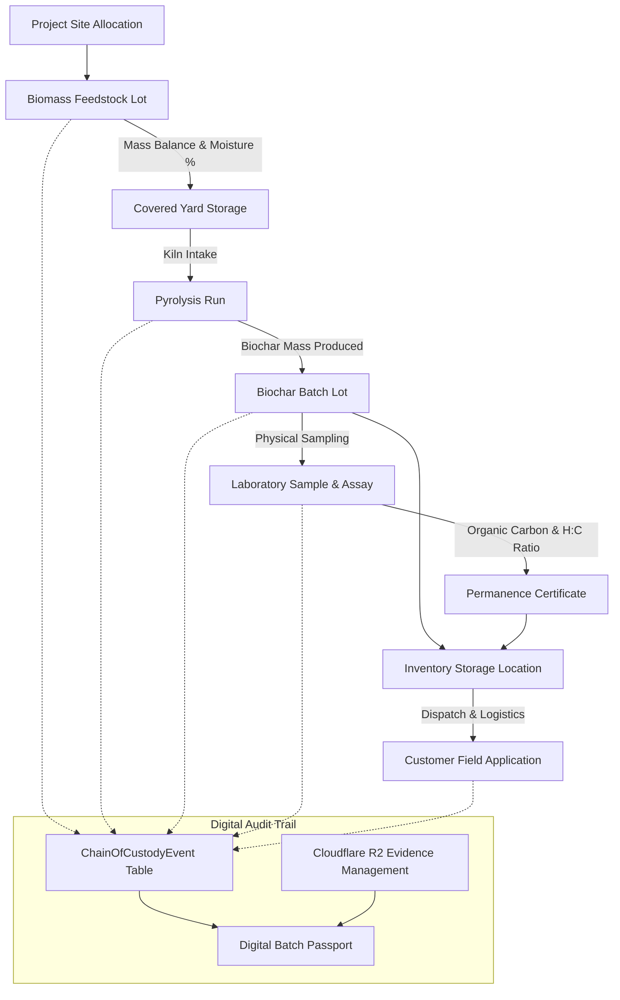

# Stomata Biochar Platform – Chain of Custody Engine (Phase 4 Documentation)

## Executive Overview
The **Chain of Custody Engine (Phase 4)** forms the foundational digital traceability layer for the Stomata Biochar Platform. It records an immutable history of material custody from the moment biomass feedstock enters the facility to final field application by the customer.

By connecting every operational transition (`Project` $\to$ `Feedstock Lot` $\to$ `Storage` $\to$ `Pyrolysis Run` $\to$ `Biochar Batch` $\to$ `Laboratory Sample` $\to$ `Inventory Warehouse` $\to$ `Distribution` $\to$ `Customer`), the engine generates verifiable **Digital Batch Passports**, detects broken custody links, and ensures complete audit readiness for carbon credit registries.

---

## 1. End-to-End Material Traceability Lineage



---

## 2. Chain of Custody Event Architecture

Every material transition automatically records an immutable event in the `chain_of_custody_events` table:

```sql
CREATE TABLE public.chain_of_custody_events (
  id uuid NOT NULL DEFAULT gen_random_uuid(),
  organization_id uuid REFERENCES public.organizations(id) ON DELETE CASCADE,
  project_id uuid REFERENCES public.projects(id) ON DELETE SET NULL,
  event_type text NOT NULL,
  parent_entity_type text,
  parent_entity_id uuid,
  child_entity_type text,
  child_entity_id uuid,
  quantity double precision,
  quantity_unit text NOT NULL DEFAULT 'kg',
  operator_id uuid REFERENCES public.profiles(id) ON DELETE SET NULL,
  site_id uuid,
  timestamp timestamp with time zone NOT NULL DEFAULT now(),
  status text NOT NULL DEFAULT 'Verified',
  notes text,
  CONSTRAINT chain_of_custody_events_pkey PRIMARY KEY (id)
);
```

### Event Transition Types
1. `FEEDSTOCK_RECEIVED`: Biomass delivered to project site
2. `FEEDSTOCK_STORED`: Biomass allocated to storage location
3. `PYROLYSIS_RUN_STARTED`: Feedstock loaded into pyrolysis reactor
4. `BIOCHAR_BATCH_PRODUCED`: Biochar batchLot produced from kiln run
5. `LAB_SAMPLE_COLLECTED`: Physical sample collected for chemical assay
6. `INVENTORY_STORED`: Batch stored in certified warehouse
7. `DISTRIBUTION_DISPATCHED`: Biochar dispatched for customer transport
8. `CUSTOMER_DELIVERED`: Biochar delivered and applied to agricultural field

---

## 3. Digital Batch Passport Structure

Every Biochar Batch automatically synthesizes a **Digital Batch Passport** (`PASSPORT-BC-{batch_code}`):

| Passport Section | Key Attributes | Verification Purpose |
| :--- | :--- | :--- |
| **Passport Header** | Passport ID, Timestamp, Verification Badge | Verifies immutable custody status (`'VERIFIED IMMUTABLE CUSTODY'`) |
| **Batch Metadata** | Produced Weight (kg), Storage Location, Status, Score | Validates lot mass and current lifecycle state |
| **Biomass Source** | Lot #, Species, Supplier, Moisture %, Origin GPS | Establishes biomass species & geographic origin |
| **Pyrolysis Run** | Run #, Reactor Name, Peak Temp (°C), Residence Time (mins) | Proves thermal conversion parameters |
| **Mass Balance** | Input Wet Mass, Input Dry Mass, Biochar Mass, Yield % | Verifies conservation of mass ($W_{\text{produced}} \le W_{\text{dry}}$) |
| **Lab Certification**| Sample ID, Organic Carbon %, H:C Ratio, Permanence Tier | Proves long-term carbon permanence (1000yr High Permanence) |
| **Evidence Files** | Photo uploads, weight scale tickets, certificate URLs, SHA-256 hashes | Provides audit evidence documentation |
| **Digital Timeline** | Visual chronological step events with operator IDs | Demonstrates unbroken custody chain |

---

## 4. Custody Chain Validation Rules

The `CustodyValidationService` continuously checks material chains for anomalies:

- `MISSING_FEEDSTOCK`: Biochar batch has no linked feedstock biomass source.
- `MISSING_LAB_RECORD`: Biochar batch has no registered sample or chemical assay.
- `MISSING_EVIDENCE`: Entity lacks photo or document evidence files.
- `QUANTITY_MISMATCH`: Produced biochar mass exceeds dry biomass input weight.
- `BROKEN_LINK`: Missing parent-child event transition in custody log.

---

## 5. API Reference

### 5.1 Digital Batch Passport & Timeline
- **Endpoint**: `GET /api/v1/biochar/chain-of-custody/passport/{batch_id}`
- **Endpoint**: `GET /api/v1/biochar/chain-of-custody/timeline/{entity_type}/{entity_id}`

### 5.2 Material History Graph
- **Endpoint**: `GET /api/v1/biochar/chain-of-custody/history/{entity_type}/{entity_id}`

### 5.3 Global Traceability Search
- **Endpoint**: `GET /api/v1/biochar/chain-of-custody/search?query=BC-2026-001`
- **Response**: Searches Batch IDs, Feedstock Lots, Sample IDs, Suppliers, and Customers.

### 5.4 Broken Custody Chains & Dashboard Stats
- **Endpoint**: `GET /api/v1/biochar/chain-of-custody/broken-chains`
- **Endpoint**: `GET /api/v1/biochar/chain-of-custody/dashboard-stats`

---

## 6. Future Expansion Compatibility

Phase 4 establishes the core architectural foundation for future integrations:
- **QR-Based Bag Tracking**: Embed Passport URL into QR codes printed on physical biochar bags.
- **Barcode & RFID Scanning**: Scan warehouse pallets directly into `chain_of_custody_events`.
- **IoT Sensor Integration**: Feed real-time reactor sensor telemetry directly into custody run events.
- **Digital Signatures**: Sign material transfers with cryptographic operator keys.
- **Carbon Credit Registry Issuance**: Export Digital Batch Passports to Puro.earth / Verra registries for instant credit issuance.
