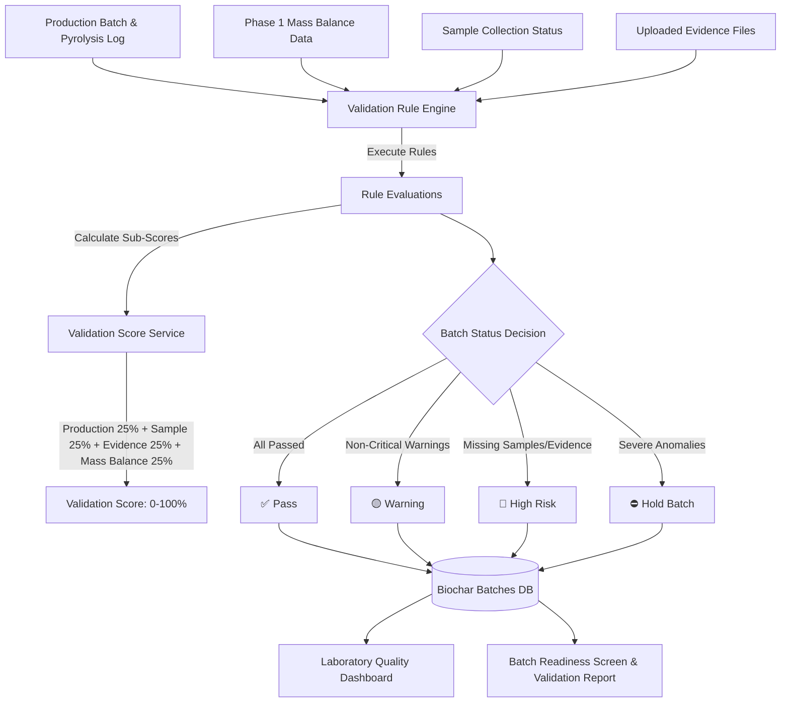

# Stomata Biochar Platform – Laboratory Validation & Anomaly Engine (Phase 2 Documentation)

## Executive Overview
The **Laboratory Validation & Anomaly Engine (Phase 2)** is an intelligent, deterministic pre-validation system that continuously evaluates production batches before laboratory submission. By analyzing pyrolysis production parameters, sample collection status, mass balance flags, and evidence completeness, the engine classifies batches into **Pass**, **Warning**, **High Risk**, or **Hold Batch**, reducing unnecessary laboratory analysis costs and ensuring high-quality carbon removal verification.

---

## 1. System Architecture & Workflow



---

## 2. Validation Rule Engine

The engine executes deterministic pre-validation rules against configurable organization thresholds:

| Rule ID | Rule Category | Condition | Severity / Status | Actionable Recommendation |
| :--- | :--- | :--- | :--- | :--- |
| `RULE_TEMP_LOW` | Temperature Validation | $\text{Peak Temp} < \text{Min Peak Temp}$ (e.g. $450^{\circ}\text{C}$) | Warning | "Low carbonization expected. Increase kiln operating temperature for next batch." |
| `RULE_RESIDENCE_TIME_LOW` | Residence Time Validation | $\text{Residence Time} < \text{Min Residence}$ (e.g. $30\text{ mins}$) | Warning | "Incomplete pyrolysis possible. Prolong reactor residence duration." |
| `RULE_MOISTURE_EXCESSIVE` | Moisture Validation | $\text{Feedstock Moisture} > \text{Max Moisture}$ (e.g. $65\%$) | Warning | "Feedstock moisture may reduce biochar fixed carbon quality. Pre-dry biomass." |
| `RULE_MISSING_SAMPLE` | Missing Sample | No BiocharSample collected | High Risk | "Collect biochar sample and assign sample ID before submitting to lab." |
| `RULE_MISSING_EVIDENCE` | Missing Evidence | Required evidence types missing | High Risk | "Upload kiln operations or batch storage photo evidence." |
| `RULE_MISSING_PARAMS` | Missing Production Logs | Missing Peak Temp, Residence Time, or Produced Mass | High Risk | "Complete missing production log parameters." |
| `RULE_HOLD_BATCH` | Quarantine Trigger | $\ge 3$ High Risk flags or Critical Anomaly | Hold Batch | "Quarantine batch for technical audit before laboratory submission." |

---

## 3. Validation Scoring Algorithm

Each batch receives a **Validation Score ($S_{\text{overall}}$ from $0\%$ to $100\%$)** composed of 4 weighted components ($25\%$ each):

$$S_{\text{overall}} = S_{\text{production}} + S_{\text{sample}} + S_{\text{evidence}} + S_{\text{mass\_balance}}$$

1. **Production Parameters Score ($S_{\text{production}} \le 25\%$)**:
   - Production log present: $+10\%$
   - Peak Temperature $\ge \text{Min Peak Temp}$: $+7.5\%$
   - Residence Time $\ge \text{Min Residence}$: $+7.5\%$
2. **Laboratory Sample Score ($S_{\text{sample}} \le 25\%$)**:
   - Biochar sample collected and sample ID assigned: $+25\%$
3. **Evidence Score ($S_{\text{evidence}} \le 25\%$)**:
   - Ratio of uploaded evidence files to required evidence types ($E_{\text{uploaded}} / E_{\text{required}} \times 25\%$).
4. **Mass Balance Score ($S_{\text{mass\_balance}} \le 25\%$)**:
   - Mass balance calculated without anomaly flags: $+25\%$ (reduced to $+10\%$ if flagged).

---

## 4. Database Schema Extensions

### `biochar_batches` Extensions
- `peak_temperature`: Double Precision
- `average_temperature`: Double Precision
- `residence_time_minutes`: Integer
- `cooling_duration`: Integer (minutes)
- `quality_status`: Text (`'Pending'`, `'Pass'`, `'Warning'`, `'High Risk'`, `'Hold Batch'`)
- `validation_status`: Text (`'Pending'`, `'Pass'`, `'Warning'`, `'High Risk'`, `'Hold Batch'`)
- `laboratory_ready`: Boolean (default `false`)
- `anomaly_count`: Integer (default `0`)
- `validation_score`: Double Precision ($0.0 - 100.0$)

### `biochar_samples` Extensions
- `sample_collection_date`: Date
- `sample_collected_by`: UUID (Foreign Key `profiles.id`)
- `laboratory_status`: Text (`'Pending'`, `'Sampled'`, `'Submitted'`, `'Certified'`)
- `validation_status`: Text (`'Pending'`, `'Pass'`, `'Warning'`, `'High Risk'`, `'Hold Batch'`)
- `risk_level`: Text (`'Low'`, `'Medium'`, `'High'`, `'Critical'`)
- `validation_score`: Double Precision
- `laboratory_notes`: Text

### `laboratory_validation_configs`
- `id`: UUID (Primary Key)
- `organization_id`: UUID (Foreign Key `organizations.id`, unique)
- `min_peak_temperature`: Double Precision (default $450.0^{\circ}\text{C}$)
- `min_residence_time_minutes`: Integer (default $30\text{ mins}$)
- `max_moisture_percent`: Double Precision (default $65.0\%$)
- `required_evidence_types`: JSONB (`["feedstock", "pyrolysis", "batch"]`)
- `required_laboratory_fields`: JSONB (`["sample_code", "collection_date"]`)

### `laboratory_validation_logs`
- `id`: UUID (Primary Key)
- `organization_id`: UUID
- `project_id`: UUID
- `batch_id`: UUID (Foreign Key `biochar_batches.id`)
- `rule_triggered`: Text
- `previous_status`: Text
- `new_status`: Text
- `validation_score`: Double Precision
- `risk_level`: Text
- `details`: JSONB
- `evaluated_by`: UUID
- `created_at`: Timestamp with time zone

---

## 5. API Reference

### 5.1 Evaluate Laboratory Validation Rules
- **Endpoint**: `POST /api/v1/biochar/laboratory-validation/rules/evaluate`
- **Payload**:
  ```json
  {
    "batch_id": "8f921a44-1294-4118-a002-120491823100"
  }
  ```
- **Response**:
  ```json
  {
    "status": "success",
    "batch_id": "8f921a44-...",
    "batch_code": "BC-2026-014",
    "validation_status": "Pass",
    "risk_level": "Low",
    "validation_score": 96.0,
    "laboratory_ready": true,
    "readiness_checklist": {
      "sample_collected": true,
      "production_complete": true,
      "mass_balance_ok": true,
      "evidence_complete": true
    },
    "warnings": [],
    "recommendations": ["Batch parameters and mass balance satisfy pre-laboratory validation. Proceed with lab submission."]
  }
  ```

### 5.2 Laboratory Validation Summary & Score
- **Endpoint**: `GET /api/v1/biochar/laboratory-validation/summary/{batch_id}`
- **Endpoint**: `GET /api/v1/biochar/laboratory-validation/score/{batch_id}`

### 5.3 Laboratory Quality Dashboard Statistics
- **Endpoint**: `GET /api/v1/biochar/laboratory-validation/dashboard-stats`
- **Response**: Returns Total Samples, Pending Samples, Passed Batches, Warning Batches, High Risk Batches, Hold Batches, and Average Validation Score.

### 5.4 Pre-Validation Warnings List
- **Endpoint**: `GET /api/v1/biochar/laboratory-validation/warnings`

---

## 6. Future Compatibility (Phase 3 & Phase 4)

- **Phase 3 (Feedstock Intelligence Engine)**: Will consume pre-validation temperature, residence time, and moisture scores to optimize biomass carbonization models.
- **Phase 4 (Chain of Custody Engine)**: Will verify that biochar shipments originate exclusively from batches with `laboratory_ready = true` and `validation_status in ('Pass', 'Warning')`.
