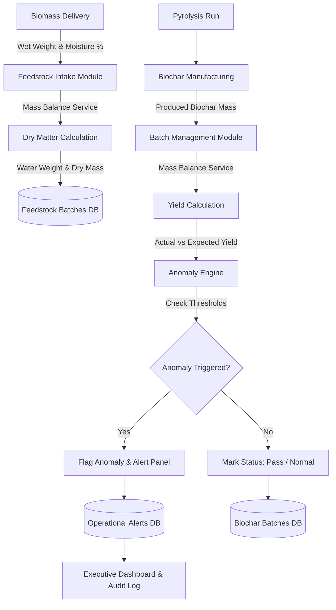

# Stomata Biochar Platform – Mass Balance & Anomaly Engine (Phase 1 Documentation)

## Executive Overview
The **Mass Balance & Anomaly Engine (Phase 1)** provides automated, real-time mass conservation tracking and rule-based anomaly detection for biochar carbon-removal projects. It establishes rigorous MRV (Measurement, Reporting, and Verification) standards by validating biomass feedstock arrivals, calculating dry matter and moisture content, computing production yield, and flagging physical or operational anomalies.

---

## 1. Architecture & System Flow



---

## 2. Calculation Logic & Mathematical Formulas

### 2.1 Feedstock Dry Matter & Water Weight
For a given wet biomass weight ($W_{\text{wet}}$ in kg) and moisture percentage ($M_{\%}$):

$$W_{\text{dry}} = W_{\text{wet}} \times \left(1 - \frac{M_{\%}}{100}\right)$$

$$W_{\text{water}} = W_{\text{wet}} \times \left(\frac{M_{\%}}{100}\right)$$

- **$W_{\text{wet}}$**: Gross wet biomass mass received (kg or metric tonnes).
- **$M_{\%}$**: Biomass moisture content percentage measured via Oven Drying (ASTM E1755), Moisture Meter, NIR Spectroscopy, or Certified Lab Analysis.
- **$W_{\text{dry}}$**: Net dry biomass mass available for pyrolysis.
- **$W_{\text{water}}$**: Evaporated moisture mass.

### 2.2 Biochar Production Yield (Dry Basis)
Given produced biochar mass ($W_{\text{produced}}$ in kg) and input dry biomass mass ($W_{\text{dry}}$ in kg):

$$Y_{\text{actual}} = \left(\frac{W_{\text{produced}}}{W_{\text{dry}}}\right) \times 100$$

- **$Y_{\text{actual}}$**: Calculated actual production yield percentage on dry biomass basis.
- **$Y_{\text{expected}}$**: Configurable target yield (default $30.0\%$).

---

## 3. Anomaly Rules & Severity Matrix

The Anomaly Engine evaluates feedstock deliveries and biochar batches against configurable thresholds:

| Rule Code | Rule Description | Threshold Condition | Severity | Category | Human-Readable Explanation Example |
| :--- | :--- | :--- | :--- | :--- | :--- |
| `RULE_MISSING_WET_WEIGHT` | Wet Weight Missing | $W_{\text{wet}} = \text{null}$ | High | Missing Measurement | "Feedstock wet weight (wet_weight_kg) is missing." |
| `RULE_MISSING_MOISTURE` | Moisture Content Missing | $M_{\%} = \text{null}$ | High | Missing Measurement | "Feedstock moisture percentage (moisture_percent) is missing." |
| `RULE_INVALID_WET_WEIGHT` | Negative/Zero Wet Weight | $W_{\text{wet}} \le 0$ | Critical | Invalid Input | "Feedstock wet weight (-50 kg) must be greater than zero." |
| `RULE_INVALID_MOISTURE` | Impossible Moisture % | $M_{\%} < 0$ or $M_{\%} > 100$ | Critical | Invalid Input | "Moisture content (110%) is impossible (must be 0-100%)." |
| `RULE_EXCESSIVE_MOISTURE` | Moisture Exceeds Max | $M_{\%} > 65.0\%$ | High | Moisture Anomaly | "Measured moisture content (72.0%) exceeds maximum threshold (65.0%)." |
| `RULE_YIELD_BELOW_MINIMUM` | Yield Below Minimum | $Y_{\text{actual}} < 15.0\%$ | High | Yield Anomaly | "Calculated biochar yield (9.2%) is below minimum threshold (15.0%). Expected ~30.0%." |
| `RULE_YIELD_ABOVE_MAXIMUM` | Yield Above Maximum | $Y_{\text{actual}} > 50.0\%$ | Critical | Yield Anomaly | "Calculated biochar yield (58.4%) exceeds maximum physical threshold (50.0%). Potential mass imbalance." |

---

## 4. Database Schema Extensions

### `feedstock_batches`
- `wet_weight_kg`: Double Precision (Gross wet mass in kg)
- `moisture_percent`: Double Precision (Biomass moisture content %)
- `dry_weight_kg`: Double Precision (Calculated dry mass in kg)
- `water_weight_kg`: Double Precision (Calculated water mass in kg)
- `expected_yield_percent`: Double Precision (Configurable expected yield %, default 30.0)
- `moisture_measurement_method`: Text (e.g. `'Oven Drying (ASTM E1755)'`, `'Moisture Meter'`)

### `biochar_batches`
- `produced_weight_kg`: Double Precision (Produced biochar mass in kg)
- `calculated_yield_percent`: Double Precision (Calculated actual yield % on dry basis)
- `mass_balance_status`: Text (`'Pending'`, `'Pass'`, `'Anomaly'`)
- `anomaly_status`: Text (`'Normal'`, `'Flagged'`, `'Resolved'`)
- `anomaly_reason`: Text (Concatenated human-readable explanations of active flags)

### `mass_balance_configs`
- `id`: UUID (Primary Key)
- `organization_id`: UUID (Foreign Key `organizations.id`, nullable for default)
- `min_yield_percent`: Double Precision (Default `15.0`)
- `max_yield_percent`: Double Precision (Default `50.0`)
- `max_moisture_percent`: Double Precision (Default `65.0`)

### `mass_balance_anomalies`
- `id`: UUID (Primary Key)
- `organization_id`: UUID (Foreign Key `organizations.id`)
- `project_id`: UUID (Foreign Key `projects.id`)
- `entity_type`: Text (`'feedstock_batch'`, `'biochar_batch'`)
- `entity_id`: UUID
- `severity`: Text (`'Low'`, `'Medium'`, `'High'`, `'Critical'`)
- `category`: Text (`'Yield Anomaly'`, `'Moisture Anomaly'`, `'Invalid Input'`, `'Missing Measurement'`)
- `human_readable_explanation`: Text
- `status`: Text (`'Active'`, `'Resolved'`)
- `created_at`: Timestamp with time zone
- `resolved_at`: Timestamp with time zone
- `resolved_by`: UUID (Foreign Key `profiles.id`)

---

## 5. API Reference

### 5.1 Feedstock Mass Balance Evaluation
- **Endpoint**: `POST /api/v1/biochar/mass-balance/feedstock/evaluate`
- **Payload**:
  ```json
  {
    "batch_code": "FS-881923",
    "project_id": "c1f73b88-1249-4112-b92e-50ab29f12301",
    "feedstock_type": "rice_husk",
    "wet_weight_kg": 12500.0,
    "moisture_percent": 14.5,
    "moisture_measurement_method": "Oven Drying (ASTM E1755)",
    "expected_yield_percent": 30.0
  }
  ```
- **Response**:
  ```json
  {
    "status": "success",
    "batch_id": "7b821f92-...",
    "wet_weight_kg": 12500.0,
    "dry_weight_kg": 10687.5,
    "water_weight_kg": 1812.5,
    "anomalies": []
  }
  ```

### 5.2 Biochar Batch Mass Balance Evaluation
- **Endpoint**: `POST /api/v1/biochar/mass-balance/batch/evaluate`
- **Payload**:
  ```json
  {
    "batch_code": "BC-109283",
    "pyrolysis_run_id": "d981240a-...",
    "produced_weight_kg": 3400.0
  }
  ```
- **Response**:
  ```json
  {
    "status": "success",
    "calculated_yield_percent": 31.81,
    "mass_balance_status": "Pass",
    "anomaly_status": "Normal",
    "anomalies": []
  }
  ```

### 5.3 Dashboard Statistics
- **Endpoint**: `GET /api/v1/biochar/mass-balance/dashboard-stats`
- **Response**: Returns aggregated wet biomass, dry biomass, average moisture, biochar volume, average yield, active anomalies count, and yield trend timeline.

### 5.4 Operational Alerts
- **Endpoint**: `GET /api/v1/biochar/mass-balance/alerts`
- **Resolve Alert**: `POST /api/v1/biochar/mass-balance/alerts/{id}/resolve`

---

## 6. Audit & Traceability
Every mass balance evaluation and anomaly resolution generates an immutable record in `evidence_audit_logs` containing:
- `action`: `FEEDSTOCK_MASS_BALANCE_EVALUATION`, `BIOCHAR_MASS_BALANCE_EVALUATION`, or `RESOLVE_MASS_BALANCE_ANOMALY`
- `details`: Exact JSON snapshot of inputs, outputs, anomalies, and user IDs.

---

## 7. Foundation for Future Phases
This Phase 1 Mass Balance & Anomaly Engine cleanly lays the groundwork for:
- **Phase 2 (Laboratory Validation)**: Correlating chemical H:C ratios and fixed carbon content with mass yield.
- **Phase 3 (Feedstock Intelligence)**: Predicting target yield per biomass species and geographic region.
- **Phase 4 (Chain of Custody)**: Ensuring mass balance conservation across transport, storage, and final field application.
